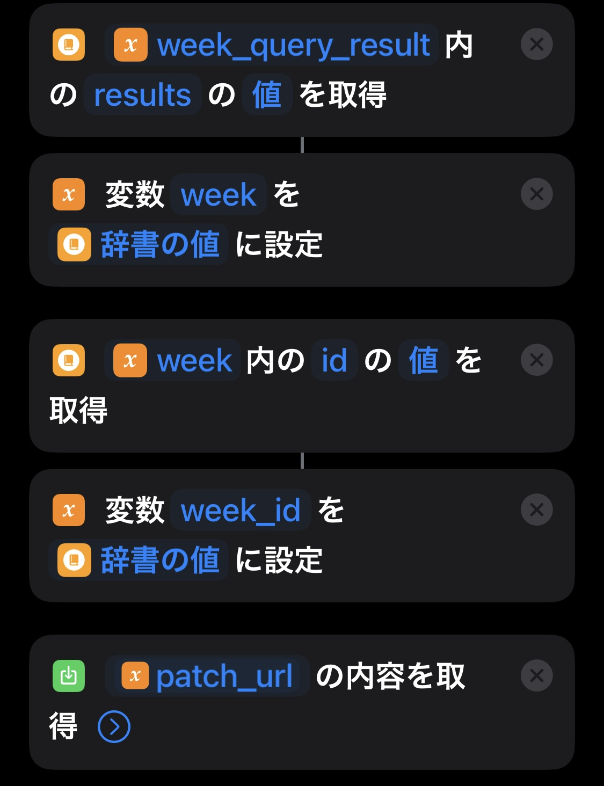

## 目次

```toc
```

## TL; DR

iOS のヘルスケアアプリに溜まっていく体重等のデータを Notion データベースと同期したい。
毎日手入力しても良いが面倒。面倒だと続かなくなってしまう。
そこで、iOS Shortcuts を利用して日次で Notion に自動入力されるようにした。

## 背景

- 体重と体脂肪率データ推移を並べて見たい
    - 単に体重を減らすことではなく**体脂肪を減らすこと**がダイエットの目的であるため
    - なんなら（正確さは求めないので）体脂肪量と除脂肪体重の推移も一緒に見たい
- 週単位での平均値の推移を見たい
    - 漫然と日時の計測を続けているだけでは、上昇トレンドなのか下降トレンドなのか、またその度合いもイマイチわからない
- フィットネスや歩数の記録データとの相関を見てみたいが、ヘルスケアアプリの UI では困難
    - 本記事ではここまで扱わないが、ヘルスケアアプリから Notion にデータを集めておくことによって将来の分析が容易なものになることが期待できる

➡️ 計測データの流れ


## 解決策

### Notion データベース設定

#### 日次データベース

- 各プロパティの設定値
    
    
    | プロパティ名 | プロパティ種別 | 説明 |
    | --- | --- | --- |
    | 日付 | date | 計測日 |
    | 体重 | number | ここに計測値を連携する |
    | 体脂肪率 | number | ここに計測値を連携する |
    | 脂肪量 | formula | 計測値から適当に計算する |
    | 除脂肪量 | formula | 計測値から適当に計算する |
    | 計測済 | formula | 「体重」が入力されていれば true |
    | 週次平均値 | relation | 後述の週次平均レコードへの紐付けを設定する |
    | 週番号 | formula | 「日付」を ’YYYYw’ の形式で format する |
- 繰り返し設定
    - 毎日0時に新しいレコードを作成
    - 「日付」に当日の日付が入るように設定
        - 方法は[こちら](https://www.notion.so/ccc054d232254c89a2a64d548387ea21?pvs=21)を参照
- 適当なインテグレーションを設定して token を控えておく
    - 方法は[こちら](https://www.notion.so/ja-jp/help/create-integrations-with-the-notion-api#%E5%86%85%E9%83%A8%E3%82%A4%E3%83%B3%E3%83%86%E3%82%B0%E3%83%AC%E3%83%BC%E3%82%B7%E3%83%A7%E3%83%B3%E3%81%AE%E4%BD%9C%E6%88%90)
- 完成イメージ
    
    

#### 週次平均データベース

- 各プロパティの設定値
    | プロパティ名 | プロパティ種別 | 説明 |
    | --- | --- | --- |
    | 週 | title | @Today |
    | 体重 | rollup | 日次レコードの「体重」の平均値 |
    | 体脂肪率 | rollup | 日次レコードの「体脂肪率」の平均値 |
    | 脂肪量 | rollup | 日次レコードの「脂肪量」の平均値 |
    | 除脂肪量 | rollup | 日次レコードの「除脂肪量」の平均値 |
    | _体重 | relation | 日次レコードへのリレーション |
    | 週始め | date | 週の最初の日の日付 |
    | 週番号 | formula | 「週始め」を ’YYYYw’ の形式で format する |
- 繰り返し設定
    - 毎週日曜日の0時に新しいレコードを作成
    - 「週始め」に当日の日付が入るように設定
        - 方法は[こちら](https://www.notion.so/ccc054d232254c89a2a64d548387ea21?pvs=21)を参照
- 適当なインテグレーションを設定して token を控えておく
    - 方法は[こちら](https://www.notion.so/ja-jp/help/create-integrations-with-the-notion-api#%E5%86%85%E9%83%A8%E3%82%A4%E3%83%B3%E3%83%86%E3%82%B0%E3%83%AC%E3%83%BC%E3%82%B7%E3%83%A7%E3%83%B3%E3%81%AE%E4%BD%9C%E6%88%90)
    
- 完成イメージ
    
    

### iOS Shortcuts 作成

#### 1. 当日の体重を Notion に連携するショートカット

- 日次データベースの database_id を設定する
    
    
    
- ヘルスケアアプリから当日の体重の計測値を取得する
    
    
    
- 当日分の日次レコード検索用に Notion API の URL を用意する
    
    
    
- POST API を call して当日分の日次レコードを取得する
    
    
    
- API call 部分のイメージ
    
    
    
- PATCH API を call して当日分の日次レコードに体重の計測値を入力する
    
    
    
- API call 部分のイメージ
    
    

#### 2. 当日の体脂肪率を Notion に連携するショートカット

1. [体重用ショートカット](#当日の体重を-notion-に連携するショートカット)をコピーし以下のように修正する
    1. ヘルスケアアプリから取得する値を「体脂肪率」に変更
    2. PATCH API で更新する property を「体脂肪率」に変更

#### 3. 当日の計測レコードを週次平均レコードに紐付けるショートカット

- **TODO:** やっつけで作ったままの状態で可読性が低すぎるのでどうにかする
    
    
    
    
    
    
    
    
    
    
    
    
    
    
    
    
    
    
    

#### 上記3つのショートカットをオートメーションで毎日10時に実行

1. 朝10時までには体重計測が終わっているだろうという想定

## 終わりに

約1ヶ月運用してみて、以下の点でダイエットに寄与していると感じた。

- 除脂肪体重をある程度維持したまま脂肪量を減らせていることを確認できる
    - 体重と体脂肪率だけ追っていると、一見体重・体脂肪率ともに順調に減っているように見えても、筋肉までごっそり減ってしまっているという事象に気付きにくい
    - 2023年1月は除脂肪体重をほぼ維持しながら脂肪量を約1.2kg減らせたので上々の成果と言えると思う
- 日々の計測結果に一喜一憂しなくなった
    - 日々計測値は上下するので、計測したその場では一貫したトレンドがないように感じられモチベーションが下がってしまいがち
    - しかし週平均の数値を追うことでトレンドが可視化され、日単位での結果にモチベーションを左右されることが少なくなった
