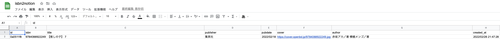

## 目次

```toc
```

## 課題

蔵書を Notion のデータベースで管理していて、新しい書籍を購入するたびに手作業でぽちぽち入力していたが、以下の課題を感じていた。

1. 単純に入力作業が面倒
2. タイトルや著者を入力する際のフォーマットが統一できておらず、検索性が良くない
3. 出版社等のカラムを新たに増やそうと思うと、途方もない手作業が発生しそうなのでやりたくない

## やりたいこと

1. ISBN から書誌情報を取得して、そのまま Notion のデータベースに入れられるようにする
2. ISBN の手入力はどう考えても面倒なので、カメラでバーコードを読み取って入力できるようにする

## 処理イメージ


## やったこと

### Spreadsheet を準備する

1. 新しく Google Spreadsheet を作成する
    1. Spreadsheet 名 : isbn2notion
    2. sheet 名: books
    3. カラム名
        1. ID
        2. isbn
        3. title
        4. publisher
        5. pubdate
        6. cover
        7. author
        8. created_at



### AppSheet アプリを作成する

#### [AppSheet](https://www.appsheet.com/Template/Apps)から新規アプリを作成し Columns の設定を行う

1. `Make a new app` → `Start with your own data`と選択し、`App name`には任意の名前を入力する
2. `Choose your data`を押下し、[上記](#spreadsheet-を準備する)で設定した Spreadsheet 名を選択し、`Select`を押下する
3. App が作成されたら画面左カラムから`Data` → `Columns`と遷移し、[上記](#spreadsheet-を準備する)で設定した Spreadsheet 内の sheet 名（books）を選択した上で、以下のように各項目を修正する
    

#### AppSheet Workflow 機能から GAS を kick する設定を行う

1. AppSheet の画面左カラムから`Automation` → `Bots`と遷移する
2. `New Bot`を押下し、name として`When a books record is created, updated, or deleted, send a notification`を指定する
    1. // TODO: ちょっと hacky な手順に見えるので、正攻法を確認すること
3. Event の中身は以下のように設定する
    
4. `Processes`タブに遷移して`table`として`books`を選択し、新しい`task`を作成する。`task`の中身は以下のように設定する
    
5. `Bots`タブに戻り、作成した`task`を`event`に紐付ける
6. 画面左カラムの`Manage` → `Integrations` → `IN: from cloud services to your app`を`Enable`にする
7. `Create Application Access Key`を押下し、新しく Application Access Key を発行する
8. `Show Access Key`を押下して表示される文字列と`App Id`を控えておく

### Notion のデータベースを準備する

1. 以下のような property を持つデータベースを用意しておく
    1. Title
    2. Author
    3. Publisher
    4. PubDate
    5. ISBN


1. 内部インテグレーションを作成し、token を控えておく
    [Notion APIを使用したインテグレーションの作成](https://www.notion.so/ja-jp/help/create-integrations-with-the-notion-api#%E5%86%85%E9%83%A8%E3%82%A4%E3%83%B3%E3%83%86%E3%82%B0%E3%83%AC%E3%83%BC%E3%82%B7%E3%83%A7%E3%83%B3%E3%81%AE%E4%BD%9C%E6%88%90)

2. 内部インテグレーションをデータベースに付与する
    1. ページ右上の「共有」から、作成した内部インテグレーションを「招待」する

### GAS を deploy する

```
$ clasp push
```

#### openBD について

[openBD](https://openbd.jp/)

#### ソースコード

https://github.com/barleytea/isbn2notion