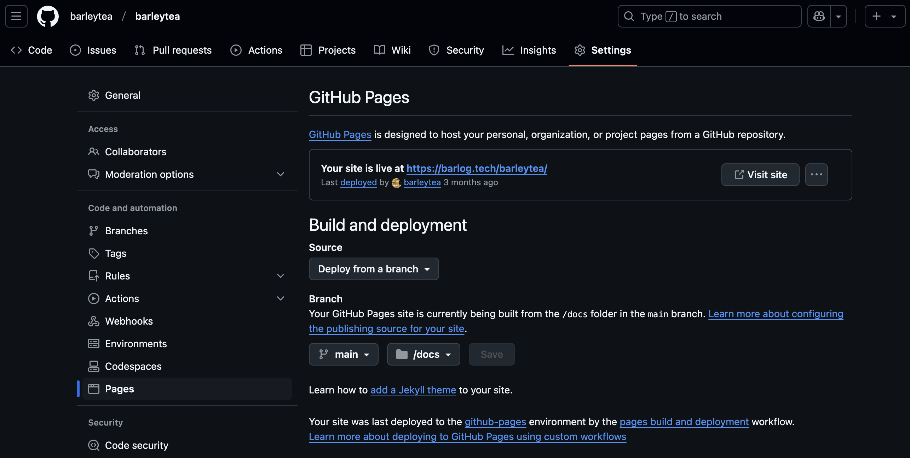

## 目次

```toc
```

いざ必要になってから更新しようとするとまごついてしまうのが職務経歴書というもの。CI を活用することで、更新から提出までをスムーズに行えるようにした。

トピックとしては N 番煎じではあるけれども、自分で実践した結果ワークしているので記録として残しておく。

## TL;DL

* 履歴書をマークダウンで記述して GitHub で管理するようにした
* GitHub Pages を利用して職務経歴書を Web ページとして公開した
* GitHub Actions を利用して下記の自動化を実現した
    * textlint/markdownlint による文法・誤字脱字のチェック
    * マークダウンファイル → PDF ファイルへの変換・アップロード
    * 履歴書 PDF のバージョン管理

## メリット

職務経歴書を GitHub で管理し、CI を回すことで以下のメリットが得られる。

1. **一元管理**: 職務経歴書を GitHub リポジトリで管理することで、バージョン管理が容易になる。
2. **自動化**: GitHub Actions を利用して、文法チェックや PDF 変換を自動化できる。
3. **公開**: GitHub Pages を利用して、職務経歴書を Web ページとして公開できる。


## 成果物

* [GitHub Repository](https://github.com/barleytea/barleytea)
* [PDF Download](https://github.com/barleytea/barleytea/releases)
* [Web Page](https://barlog.tech/barleytea/)

## 手順

### 1. マークダウンファイルを作成する

プロジェクトルートに `docs` ディレクトリを作成してそこに `README.md` を作成する。
GitHub Pages の公開用ディレクトリとして `docs` を使用する（後述）。

最も難しい部分である「職務経歴書」の内容については本記事では触れないので、各自で調べて書き上げること（これに関しては誰か教えてほしい）。

### 2. Lint を導入する

職務経歴書をマークダウンで書くことのメリットの一つは、機械的に Lint をかけられるようになるという点だ。
これにより誤字脱字や技術用語のミススペル（大文字・小文字など）を防ぐことができる。

#### textlint を導入する

```sh
npm install --save-dev textlint
```

##### textlint のルールを設定する

[ドキュメント](https://github.com/textlint/textlint/wiki/Collection-of-textlint-rule) を参照したり、[grep.app](grep.app) で `.textlintrc.json` の実例を参考にしたりして作成する。

##### 私の設定例

[.textlintrc.json](https://github.com/barleytea/barleytea/blob/main/config/.textlintrc.json)

#### markdownlint を導入する

```sh
npm install --save-dev markdownlint-cli
```

##### markdownlint のルールを設定する

こちらも[公式ドキュメント](https://github.com/DavidAnson/markdownlint/blob/main/doc/Rules.md) を参照しつつ、[grep.app](grep.app) で見つけた実例を ~~パクって~~ 参考にして `.markdownlint.jsonc` を作成する。

###### 私の設定例

[.markdownlint.jsonc](https://github.com/barleytea/barleytea/blob/main/config/.markdownlint.jsonc)

#### Lint 用のコマンドを設定する

```json:package.json
"scripts": {
    "lint": "textlint -c ./config/.textlintrc . && markdownlint -c ./config/.markdownlint.jsonc docs/*.md",
    "lintfix": "textlint --fix -c ./config/.textlintrc . && markdownlint -c ./config/.markdownlint.jsonc docs/*.md",
},
```

##### 実行

```sh
npm run lint
```

または

```sh
npm run lintfix
```

### 3. PDF ファイルへの変換

実際に職務経歴書を提出する際には PDF 形式が望ましい場合が多い。  
そこで [md-to-pdf](https://github.com/simonhaenisch/md-to-pdf) を利用して Markdown から PDF に変換できるようにする。

#### md-to-pdf の導入手順

1. インストール

    ```sh
    npm install --save-dev md-to-pdf
    ```

1. プロジェクト直下に pdf-configs フォルダを作成し、`config.js` と `style.css` を作成する

    - 設定例:

        - [config.js](https://github.com/barleytea/barleytea/blob/main/pdf-configs/config.js)
        - [style.css](https://github.com/barleytea/barleytea/blob/main/pdf-configs/style.css)

1. `package.json` に Markdown → PDF 変換用のコマンドを設定する

    ```json:package.json
    "scripts": {
        ... 中略
        "build:pdf": "md-to-pdf docs/README.md --config-file ./pdf-configs/config.js"
    },
    ```

1. 実行

```sh
npm run build:pdf
```

#### GitHub Actions の設定

毎回上記のように手動で PDF を作成しても良いが、どうせなら GitHub Actions に乗せて CI を回そう。
下記のように `.github/workflows/pdf.yml` を作成する。

```yaml:pdf.yml
name: Release PDF

on:
  push:
    tags:
    - 'v*'

jobs:
  build:
    name: build pdf and upload release
    runs-on: ubuntu-latest
    steps:
      - uses: actions/checkout@v4
        with:
          fetch-depth: 0
      - uses: actions/setup-node@v4
        with:
          node-version-file: 'package.json'
          cache: 'npm'
      - name: Install dependencies
        run: npm install
      - name: build pdf
        run: npm run build:pdf
      - name: create release
        id: create_release
        uses: actions/create-release@v1
        env:
          GITHUB_TOKEN: ${{ secrets.GITHUB_TOKEN }}
        with:
          tag_name: ${{ github.ref }}
          release_name: Release ${{ github.ref }}
          draft: false
          prerelease: false
      - name: upload Release Asset
        id: upload-release-asset
        uses: actions/upload-release-asset@v1
        env:
          GITHUB_TOKEN: ${{ secrets.GITHUB_TOKEN }}
        with:
          upload_url: ${{ steps.create_release.outputs.upload_url }}
          asset_path:  docs/README.pdf
          asset_name: README.pdf
          asset_content_type: application/pdf
```

push イベントでタグが `v*` の形式である場合、PDF をビルドして新しいリリースに PDF ファイルをアップロードしている。  
これにより成果物をバージョン管理しつつ、[リリースページ](https://github.com/barleytea/barleytea/releases)から PDF をダウンロードできるようになる。

### 4. Web ページとして公開

ページデザインは `docs/_config.yml` で設定することができる。

```yaml:_config.yml
remote_theme: pages-themes/hacker@v0.2.0
title: 三好翔太の職務経歴書
description: 三好翔太の職務経歴書
```

[Supported themes](https://pages.github.com/themes/) から好みのテーマを選んで`remote_theme` に設定すること。

リポジトリの設定から GitHub Pages を有効にし、公開するブランチを選択する。  
公開用ディレクトリは `docs` を指定すれば良い。



### 5. 履歴書への対応

職務経歴書と同じ要領で履歴書も git で管理できるが、こちらはよりセンシティブな個人情報を含み、かつ職務経歴書ほど更新頻度は高くなくて良い。
そのため、private repository での管理とし、Web での公開や Release の作成はせず、手元での lint と PDF 化のみ運用している。

## 終わりに

今回転職活動をするにあたって職務経歴書の管理方法を大きく見直した。  
無事に内定を頂くことができた要因の1つであると感じている。

今後副業を検討する際にも使えるよう、より一層継続的に職務経歴書をブラッシュアップしていきたい。
